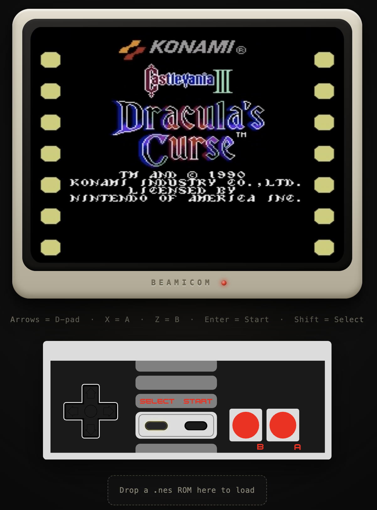

# BeamicomPhx

Web client for the [`beamicom`](https://github.com/dbernheisel/beamicom) NES
emulator. A Phoenix LiveView app that streams a running console's audio/video
to the browser over WebRTC and relays controller input back.

Part of the three-project setup described in the
[core README](https://github.com/dbernheisel/beamicom):

```
~/beamicom          # core emulator (headless)
~/beamicom_scenic   # desktop client — Scenic/OpenGL window
~/beamicom_phx      # this project — browser client
```



## Modes

The app runs in one of two modes set by the `BEAMICOM_MODE` env var (default: `server`).

| Mode | What it does |
|------|-------------|
| `server` | Runs the emulator locally, encodes A/V with FFmpeg/Opus, and streams it to every connected browser over WebRTC. Accepts ROM drops and controller input from the browser. |
| `client` | Attaches to a running server node's relay instead of running its own emulator. Watch-only: no ROM drop, no controller. |

## Setup

Depends on `beamicom` as a sibling path dependency:

```
~/beamicom          # clone this first
~/beamicom_phx      # then this
```

```sh
mix setup           # deps + assets
```

## Running

### Server mode

```sh
BEAMICOM_ROM=roms/game.nes mix phx.server
```

`BEAMICOM_ROM` is required in server mode — the emulator starts at boot with
that ROM. You can swap ROMs at runtime by dragging a `.nes` file onto the drop
zone in the browser.

Default port: **4044**.

### Client mode

```sh
BEAMICOM_MODE=client mix phx.server
```

Default port: **4046**. The client connects to the server's relay; make sure
the server node is reachable.

## Browser UI

- **Video** — CRT-styled 4:3 WebRTC stream, unmuted on first key/pointer press
  (browsers block autoplay audio).
- **Controller** *(server mode only)* — keyboard bindings and an on-screen
  touch gamepad.

| Key | NES button |
|-----|------------|
| Arrow keys | D-pad |
| X | A |
| Z | B |
| Enter | Start |
| Shift | Select |

- **ROM drop zone** *(server mode only)* — drag a `.nes` file onto the labelled
  area at the bottom of the page to (re)load the emulator. All connected
  browsers pick up the new game immediately.
